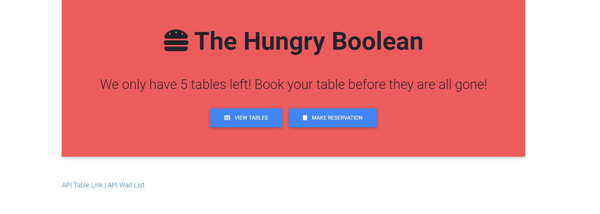
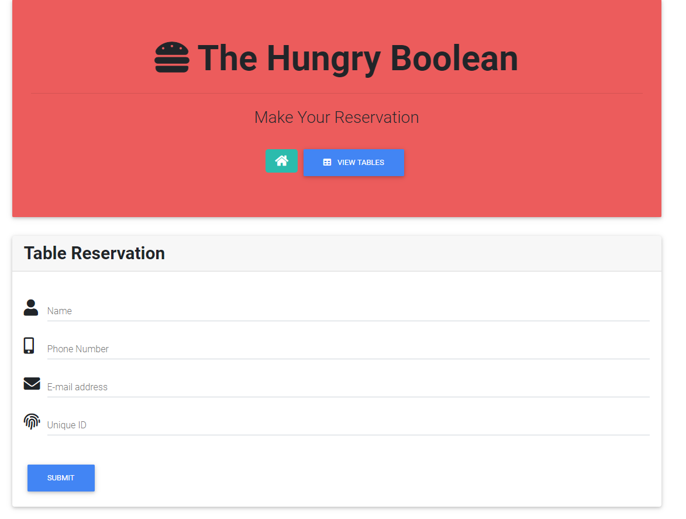

# Restaurant

This application allows for users to make reservations and view the current occupied tables as well as the waitlist at their favorite local restaurant, The Hungry Boolean! The Hungry Boolean page also allows for users to track what tables are taken and allows the ability to clear a table once a party has left.

## Usage 

From the homepage, the user has the choice to view the current occupied tables or make a reservation. Navigating to the view tables page by selecting the button to do so. From there, up to 5 tables can be filled before a new reservation will be added to the waitlist. Navigating to the make a reservation page by selecting the button to do so in the header. This form takes in the user's name, email, phone number, unique ID and then moves the information to the appropriate location, whether it is a table or the waitlist.

## Application Photos

